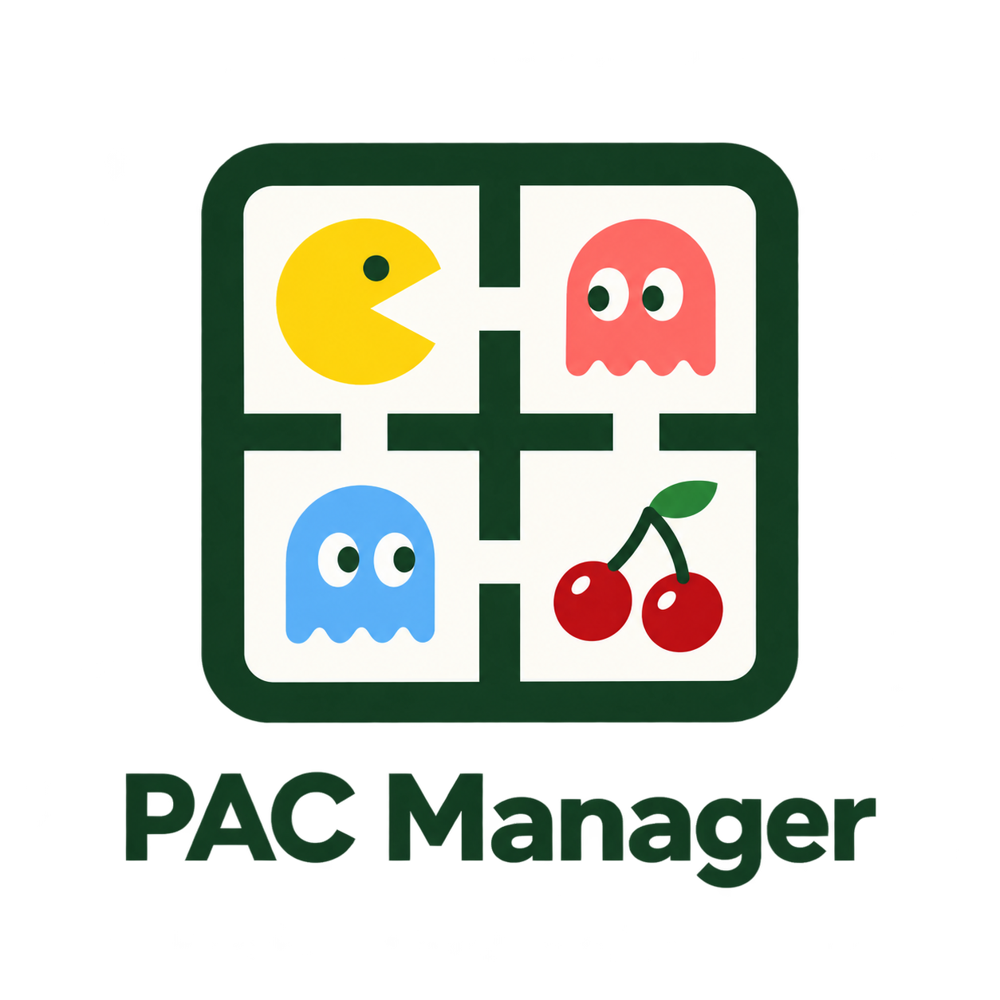

# PAC Manager


Portable Artifact Contract manager — build with your AI, keep control of your software.

An Apache-2.0 open-source project intended to demonstrate interesting AI engineering at Plymouth Rock. No commercial edition, paid governance tier, or insurer-specific core. Organizational endorsement, trademarks and release communications require maintainer approval.

## Status: runnable bounded demo
The [five-minute demo](docs/demo.md) now supports MCP authoring, container build adapters, live previews, document uploads, scoped team notes, mock claims, internal publication and standalone graduation downloads. Start locally with Node.js 22+ and Docker:

```sh
npm run demo:setup
npm run demo
```

Open http://127.0.0.1:3000 and sign in with the token in `.pac-demo/owner.token`. Follow the [demo script and Claude connection instructions](docs/demo.md). A [private Kubernetes/EKS deployment path](deploy/demo.md) uses the same application with ephemeral build Jobs.

The **Graduate** view generates Architecture Review Board, Systems Readiness and Bill of Materials reports from one structured JSON record. Published app changes automatically refresh observed facts and flag authored decisions for re-review. Preview/download reports and publish a reviewed code-only snapshot to a configured private GitHub repository. See [living assurance and GitHub publishing](docs/assurance.md).

This is **not a production untrusted-code host**. Applications use constrained definitions and trusted templates. The implementation workspace verified the flow using explicit process mode; Docker/EKS enforcement and a live desktop-client/browser rehearsal are separate gates. See [verification status](docs/implementation-status.md).

The original CLI still validates alpha contracts, produces deterministic deployment plans and exports graduation metadata. Its pure policy evaluator remains a reference implementation, not the demo's network enforcement mechanism.

No cloud account, model key or npm installation is needed for these commands (Node.js 22+):
```sh
npm test
npm run check
npm run demo:plan
node src/cli.js validate examples/knowledge-hub/artifact.json
node src/cli.js export examples/knowledge-hub/artifact.json
```
Example image digests are placeholders. Do not deploy them.

## What we are building
Business users create applications, agents, knowledge hubs and interactive documents through their existing AI tools. Approved low-risk work can be shared without an IT ticket. Real source, data migrations, service contracts, tests and operational evidence remain exportable as the application grows.

Start with [product](docs/product.md), [architecture](docs/architecture.md), [threat model](docs/threat-model.md), [specifications](specs/README.md), [roadmap](docs/roadmap.md) and [developer guide](docs/development.md).

[SpecGuard](https://github.com/jazzmind/specguard) supplies optional living-spec tooling.
[PACOS](https://github.com/jazzmind/pacos) is the first proposed agent pack: open-source project operations, community support and evidence-backed promotion.

## Repository map
- `src/`: dependency-free contract, policy, planner and CLI reference core.
- `demo/`: runnable workspace, MCP bridge, trusted builder and standalone export.
- `test/`: independent executable acceptance tests.
- `specs/`: living specifications with stable requirement IDs.
- `docs/`: product, architecture, decisions, operations and integration contracts.
- `schemas/`: strict machine-readable alpha artifact schema.
- `examples/`: synthetic artifact contracts.
- `deploy/`: demo Kubernetes manifest generator and separate security-baseline references.
- `.specguard/`: opt-in QA configuration; no automatic healing.

## Contributions
Useful first contributions include schema/validator parity, a mock capability provider, a constrained runtime adapter, permission-aware knowledge APIs and tested export/import round trips. See [CONTRIBUTING](CONTRIBUTING.md). Maintainers retain authority over security policy and releases.
